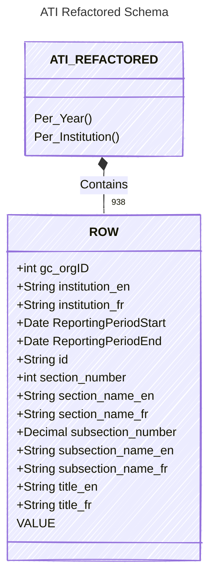
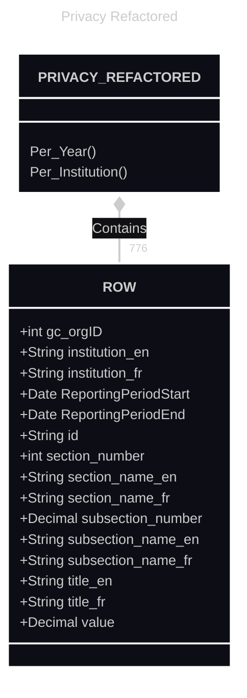
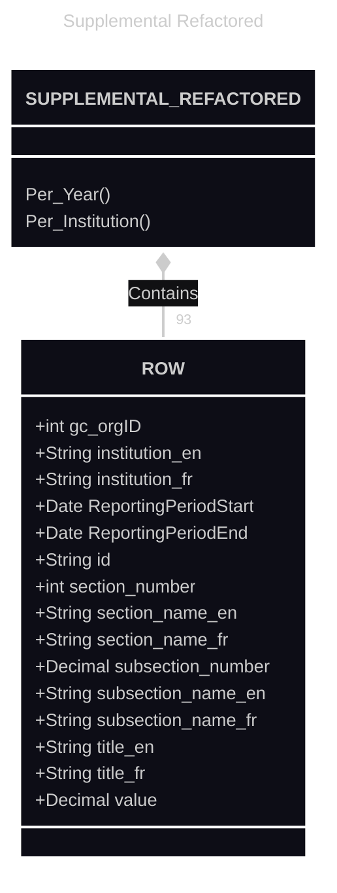

```mermaid
---
config:
  class:
    hideEmptyMembersBox: true
  theme: mc
  look: handDrawn
title: ATI Refactored Schema
---
classDiagram
direction TB
    class ATI_REFACTORED {
	    Per_Year()
	    Per_Institution()
    }

    class ROW {
	    +int gc_orgID
	    +String institution_en
	    +String institution_fr
	    +Date ReportingPeriodStart
	    +Date ReportingPeriodEnd
	    +String id
	    +int section_number
	    +String section_name_en
	    +String section_name_fr
	    +Decimal subsection_number
	    +String subsection_name_en
	    +String subsection_name_fr
	    +String title_en
	    +String  title_fr
	    VALUE
    }

    ATI_REFACTORED *--"938" ROW : Contains
```

```mermaid
---
config:
  class:
    hideEmptyMembersBox: true
  theme: redux-dark
  look: neo
title: Privacy Refactored
---
classDiagram
direction TB
    class PRIVACY_REFACTORED {
        Per_Year()
        Per_Institution()
    }

    class ROW {
        +int gc_orgID
        +String institution_en
        +String institution_fr
        +Date ReportingPeriodStart
        +Date ReportingPeriodEnd
        +String id
        +int section_number
        +String section_name_en
        +String section_name_fr
        +Decimal subsection_number
        +String subsection_name_en
        +String subsection_name_fr
        +String title_en
        +String title_fr
        +Decimal value
    }

    PRIVACY_REFACTORED *--"776" ROW : Contains
```

```mermaid
---
config:
  class:
    hideEmptyMembersBox: true
  theme: redux-dark
  look: neo
title: Supplemental Refactored
---
classDiagram
direction TB
    class SUPPLEMENTAL_REFACTORED {
        Per_Year()
        Per_Institution()
    }

    class ROW {
        +int gc_orgID
        +String institution_en
        +String institution_fr
        +Date ReportingPeriodStart
        +Date ReportingPeriodEnd
        +String id
        +int section_number
        +String section_name_en
        +String section_name_fr
        +Decimal subsection_number
        +String subsection_name_en
        +String subsection_name_fr
        +String title_en
        +String title_fr
        +Decimal value
    }

    SUPPLEMENTAL_REFACTORED *--"93" ROW : Contains
```
