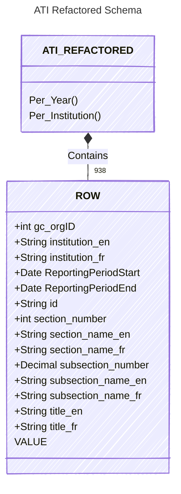

# ATI-Parse

ATI-Parse collects and normalizes Treasury Board Secretariat (TBS) statistical reporting forms for Access to Information (TBS/SCT 350-62), Privacy (TBS/SCT 350-63), and the supplemental statistical report. The goal is to parse the official form definitions (HTML/XLS), refactor open data submissions into consistent long-form tables, and generate artifacts for validation and reporting.

## Background
Institutions submit annual statistical reports to the Information and Privacy Policy Division. Reports must be in XML or XLS formats, and an HTML version of each form is published for accessibility and to document the required data elements. Historical statistical data is published in open formats.

## What’s in this repo
- Parsing notebooks for the HTML/XLS form definitions and structure extraction.
- Population notebooks that fill form templates and generate example HTML outputs.
- Refactored, long-form datasets and “rosetta” mapping artifacts to align open data with form fields.
- Validation and audit outputs that highlight mismatches or unmapped elements.

## Key notebooks
- `Parse_ATI_Stats_Forms.ipynb`
- `Parse_Privacy_Stats_Forms.ipynb`
- `Parse_Supplemental_Stats_Forms.ipynb`
- `Populate_ATI_Statistical_Reports.ipynb`
- `Populate_Privacy_Statistical_Reports.ipynb`
- `Populate_Supplemental_Statistical_Report.ipynb`

## Key outputs
- Refactored datasets: `ATI-AI_refactored.csv`, `Privacy-AI_refactored.csv`, `Supplemental-AI_refactored.csv`
- Combined form metadata: `combined_form_data.xlsx`, `combined_privacy_form_data.xlsx`, `combined_supplemental_form_data.xlsx`

- Mapping/audit artifacts: `ati_rosetta_mapping_2024_25.csv`, `ati_rosetta_mismatches_2024_25.csv`, `ati_audit_2297_2021-04-01_summary.csv`, `supplemental_rosetta_mismatches.csv`

## Refactored Dataset Schemas

### ATI

### Privacy

### Supplemental

